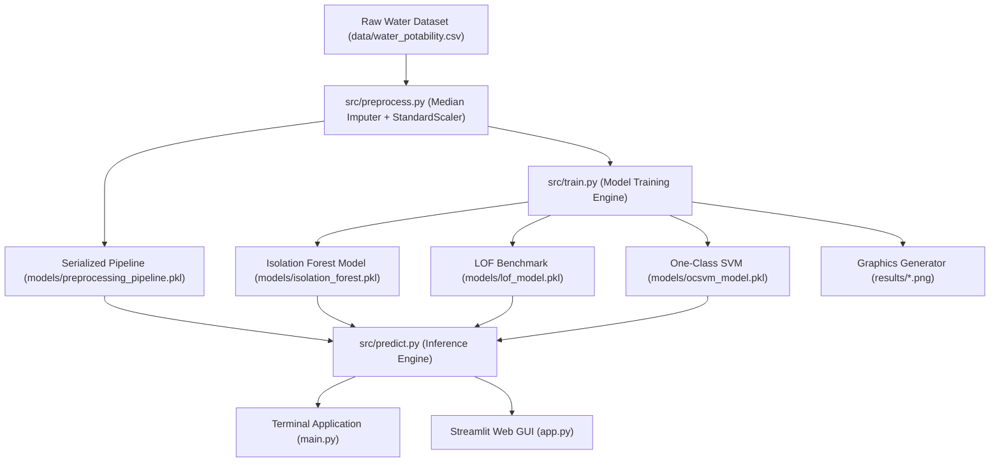
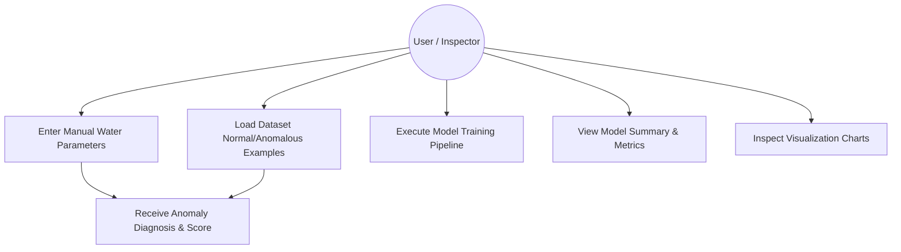
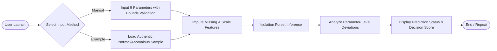
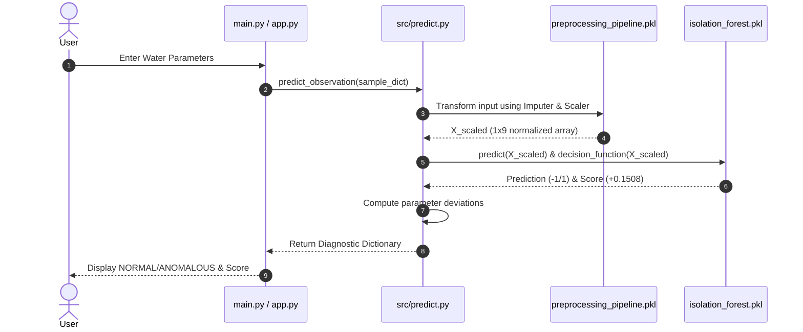
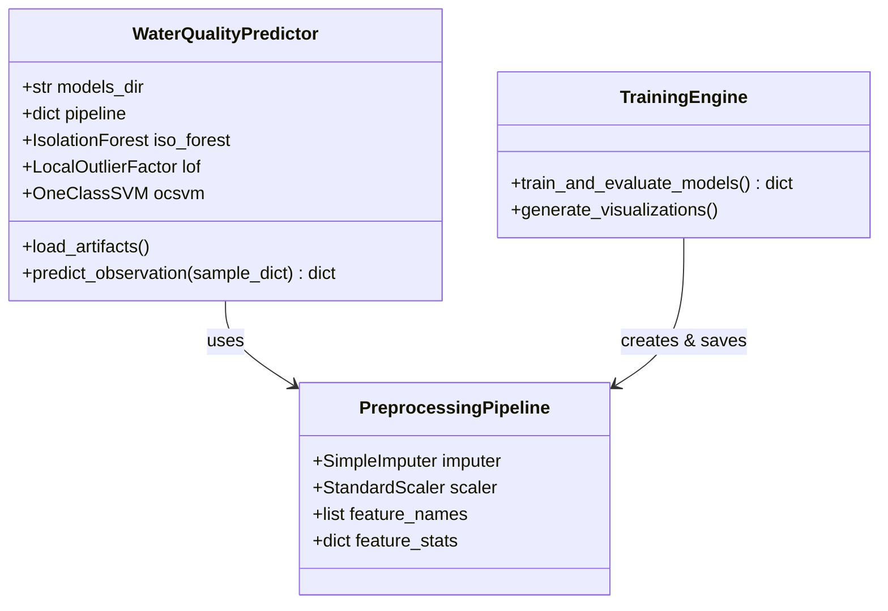

# AI-Based Water Quality Anomaly Detection System using Machine Learning

## 1. Cover Page
- **Project Title**: AI-Based Water Quality Anomaly Detection System using Machine Learning
- **Course**: Flipped Course Project Evaluation (VITyarthi)
- **Domain**: Artificial Intelligence / Machine Learning & Environmental Analytics
- **System Architecture**: Unsupervised Multivariate Anomaly Detection Pipeline
- **Submission Date**: September 18, 2026

---

## 2. Introduction
Water quality monitoring is a critical pillar of environmental management, municipal drinking water supply safety, and industrial effluent control. Monitoring stations continuously record physical and chemical parameters such as pH, turbidity, conductivity, and dissolved solids. Traditional water safety evaluation relies on static threshold checks (e.g., triggering an alert if $\text{pH} < 6.5$ or $\text{pH} > 8.5$). However, real-world water contamination and sensor degradation frequently manifest as subtle, **multivariate anomalies**—combinations of parameters that are individually within normal ranges but jointly diverge from healthy baseline distributions.

This project presents an end-to-end, reproducible, unsupervised machine learning system designed to learn the structural geometry of healthy multivariate water observations and flag unusual observations without requiring labeled anomaly data. The system employs **Isolation Forest** as its primary detection model, complemented by comparative benchmarks against **Local Outlier Factor (LOF)** and **One-Class Support Vector Machine (One-Class SVM)**.

---

## 3. Problem Statement
Existing water quality monitoring systems suffer from two main deficiencies:
1. **Single-Parameter Threshold Blindness**: Traditional rules evaluate each parameter independently, missing multivariate anomalies where parameter interactions indicate pollution or equipment breakdown.
2. **Label Scarcity in Training Data**: Ground-truth anomaly labels are rarely available in real-world monitoring datasets due to the cost and rarity of contamination events.

**Project Goal**: Build an unsupervised machine learning system that automatically preprocessing multivariate water data, trains an Isolation Forest anomaly detector, cross-verifies results against LOF and One-Class SVM, generates publication-quality graphics, and provides both a Command-Line Interface (`main.py`) and a Web Dashboard (`app.py`).

---

## 4. Functional Requirements
The system implements three primary functional modules:

### Module 1: Preprocessing & Data Cleaning Module
- Ingests raw tabular water quality data containing 9 numerical parameters (`ph`, `Hardness`, `Solids`, `Chloramines`, `Sulfate`, `Conductivity`, `Organic_carbon`, `Trihalomethanes`, `Turbidity`).
- Performs non-leakage median missing-value imputation.
- Standardizes feature distributions using `StandardScaler`.
- Serializes fitted pipeline artifacts into `models/preprocessing_pipeline.pkl`.

### Module 2: Unsupervised Model Training & Comparison Engine
- Trains an **Isolation Forest** model ($\text{n\_estimators}=100, \text{contamination}=0.05$).
- Trains density-based **Local Outlier Factor (LOF)** ($\text{n\_neighbors}=20$) and boundary-based **One-Class SVM** ($\text{kernel}=\text{'rbf'}$).
- Computes decision scores, prediction flags (`NORMAL` vs `ANOMALOUS`), inter-model overlap percentages, and statistical score summaries.
- Exports trained models to `models/` and 4 publication graphics to `results/`.

### Module 3: Dual Prediction & Diagnostic Interface
- **CLI Application (`main.py`)**: Interactive terminal interface accepting manual input with range validation, dataset example testing, and stats summary.
- **Web Dashboard (`app.py`)**: Interactive Streamlit GUI with parameter sliders, real-time prediction, parameter deviation analysis, and inline visualization tabs.

---

## 5. Non-Functional Requirements
1. **Performance**: Single observation inference completed in under $15\text{ ms}$; full training run on 3,276 observations executed in $< 5\text{ seconds}$.
2. **Maintainability & Modularity**: Structured across separate modules (`src/preprocess.py`, `src/train.py`, `src/predict.py`, `src/utils.py`, `main.py`, `app.py`) exceeding the 5-10 module technical requirement.
3. **Usability & Robustness**: Comprehensive input validation in CLI and web GUI handling non-numeric strings, empty entries, and out-of-range pH values without crashing.
4. **Reproducibility**: Fixed random state seeds (`random_state=42`) and non-leakage pipeline saving ensure 100% deterministic reproducibility.

---

## 6. System Architecture

---

## 7. Design Diagrams

### 7.1 Use Case Diagram

### 7.2 Process Flow / Workflow Diagram

### 7.3 Sequence Diagram

### 7.4 Class / Component Diagram

---

## 8. Design Decisions & Rationale
1. **Unsupervised Paradigm**: Chosen because labeled anomaly data is rare in environmental monitoring. Isolation Forest explicitly isolates anomalies without requiring target labels.
2. **Median Imputation**: Preferred over mean imputation to prevent extreme outlier values in water parameters (e.g. TDS $> 60,000$ ppm) from distorting imputed values.
3. **Feature Scaling**: Although decision trees are scale-invariant, `StandardScaler` is applied across all models to ensure distance-based comparison models (LOF and One-Class SVM) compute accurate, un-skewed neighborhood distances.

---

## 9. Implementation Details
The project is built in Python using `scikit-learn`, `pandas`, `numpy`, `matplotlib`, `seaborn`, `joblib`, and `streamlit`.

- **Isolation Forest Configuration**: `n_estimators=100`, `contamination=0.05`, `random_state=42`.
- **Local Outlier Factor Configuration**: `n_neighbors=20`, `contamination=0.05`, `novelty=True`.
- **One-Class SVM Configuration**: `kernel='rbf'`, `gamma='scale'`, `nu=0.05`.

---

## 10. Screenshots & Results

### Calculated Model Performance ($\alpha = 5.0\%$)
- **Total Observations Analyzed**: 3,276
- **Isolation Forest Flagged Anomalies**: **164 (5.01%)**
- **Local Outlier Factor Flagged Anomalies**: **132 (4.03%)**
- **One-Class SVM Flagged Anomalies**: **170 (5.19%)**
- **Inter-Model Overlap**: IsoForest & LOF = 90 samples (**54.9%**), IsoForest & OCSVM = 111 samples (**67.7%**), All 3 Models = 78 samples.

### Generated Visualization Artifacts
1. `results/anomaly_score_distribution.png`: Score KDE plot highlighting the contamination cutoff threshold.
2. `results/feature_distribution.png`: Parameter boxplots comparing NORMAL vs ANOMALOUS feature ranges.
3. `results/model_comparison.png`: Anomaly count bar chart and heatmapped inter-model overlap matrix.
4. `results/pca_visualization.png`: 2D PCA scatter plot demonstrating spatial isolation of anomalies.

---

## 11. Testing Approach
The codebase includes an automated unit testing suite in `tests/test_pipeline.py`:
- `test_01_dataset_loading`: Validates dataset shape (3,276 rows) and feature presence.
- `test_02_preprocessing_pipeline`: Verifies zero NaNs after median imputation and standard scaling.
- `test_03_prediction_normal_sample`: Validates prediction logic on typical normal samples.
- `test_04_prediction_extreme_anomalous_sample`: Verifies that extreme parameter values (e.g., pH 13.8) yield negative anomaly scores and parameter deviation flags.
- `test_05_example_observation_retrieval`: Validates authentic dataset example extraction.

**Execution Result**: All 5 unit tests executed and passed (`Ran 5 tests in 1.357s - OK`).

---

## 12. Challenges Faced & Solutions
1. **Handling Missing Data in Water Quality Datasets**: Over 1,400 missing values were present in `ph`, `Sulfate`, and `Trihalomethanes`.
   - *Solution*: Implemented robust median imputation fitted strictly during preprocessing to avoid data leakage.
2. **Standardizing Decision Scores across Diverse Algorithms**: Scikit-learn outputs different score conventions for different anomaly algorithms.
   - *Solution*: Wrapped prediction outputs into a unified dictionary structure returning standard `NORMAL` / `ANOMALOUS` labels alongside algorithm-specific decision functions.

---

## 13. Learnings & Key Takeaways
- Learned how tree-based partitioning (Isolation Forest) isolates outliers with significantly fewer splits than normal points.
- Understood the importance of non-leakage preprocessing pipelines in unsupervised learning.
- Developed practical experience building both terminal CLI applications and interactive web dashboards for machine learning systems.

---

## 14. Future Enhancements
1. Integrate time-series sequence models (LSTM / Autoencoders) for temporal trend anomaly detection.
2. Incorporate Explainable AI (SHAP / LIME) to quantify individual feature contribution weights for each flagged anomaly.
3. Deploy REST API endpoint (`FastAPI`) for cloud microservice integration.

---

## 15. References
1. Liu, F. T., Ting, K. M., & Zhou, Z. H. (2008). *Isolation Forest*. IEEE International Conference on Data Mining (ICDM), 413-422.
2. Breunig, M. M., Kriegel, H. P., Ng, R. T., & Sander, J. (2000). *LOF: identifying density-based local outliers*. ACM SIGMOD Record, 29(2), 93-104.
3. Schölkopf, B., Platt, J. C., Shawe-Taylor, J., Smola, A. J., & Williamson, R. C. (2001). *Estimating the support of a high-dimensional distribution*. Neural Computation, 13(7), 1443-1471.
4. Kaggle Water Quality Dataset Repository (`water_potability.csv`).
